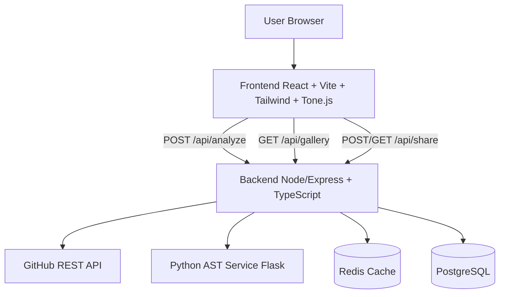

# CodeBeats

CodeBeats analyzes public GitHub repositories and turns code quality signals into music.

## Highlights
- Analyze JS/TS/Python repos from a single URL
- Map metrics to musical properties in Tone.js
- Theme system: Orchestra, Electronic, Minimal
- Shareable analysis URLs backed by PostgreSQL
- Public gallery: leaderboard, Hall of Fame, Hall of Shame
- Full multi-service Docker Compose stack

## System Architecture


## Repository Layout
- `backend/` Node/Express analysis + API routes
- `frontend/` React UI + Tone.js composition engine
- `python-service/` Flask AST analyzer for Python files
- `docker-compose.yml` full stack orchestration

## API Overview
- `POST /api/analyze` analyze repo URL
- `GET /api/gallery/leaderboard`
- `GET /api/gallery/hall-of-fame`
- `GET /api/gallery/hall-of-shame`
- `POST /api/share` create share id from analysis payload
- `GET /api/share/:id` load shared analysis
- `GET /api/auth/github/start` get OAuth authorize URL
- `GET /api/auth/github/callback` OAuth token exchange callback
- `GET /health` service health

## Local Development (without Docker)
### 1) Backend
```bash
cd backend
cp .env.example .env
npm install
npm run dev
```

### 2) Frontend
```bash
cd frontend
cp .env.example .env
npm install
npm run dev
```

### 3) Python service
```bash
cd python-service
python -m venv .venv
. .venv/Scripts/Activate.ps1
pip install -r requirements.txt
python app.py
```

## Full Stack via Docker Compose
```bash
docker-compose up --build
```

Services:
- Frontend: `http://localhost:5173`
- Backend: `http://localhost:3001`
- Python service: `http://localhost:5000`
- Postgres: `localhost:5432`
- Redis: `localhost:6379`

## Environment Variables
### Backend (`backend/.env`)
- `PORT`
- `GITHUB_TOKEN`
- `GITHUB_OAUTH_CLIENT_ID`
- `GITHUB_OAUTH_CLIENT_SECRET`
- `GITHUB_OAUTH_REDIRECT_URI`
- `FRONTEND_BASE_URL`
- `REDIS_HOST`, `REDIS_PORT`, `REDIS_PASSWORD`
- `PYTHON_SERVICE_URL`, `PYTHON_SERVICE_TIMEOUT_MS`
- `POSTGRES_HOST`, `POSTGRES_PORT`, `POSTGRES_USER`, `POSTGRES_PASSWORD`, `POSTGRES_DB`

### Frontend (`frontend/.env`)
- `VITE_API_BASE_URL`

## GitHub OAuth App Setup
1. Open `https://github.com/settings/applications/new`
2. Set:
   - App name: `CodeBeats`
   - Homepage URL: your frontend URL (local: `http://localhost:5173`)
   - Authorization callback URL: backend callback (local: `http://localhost:3001/api/auth/github/callback`)
3. Copy client ID and secret into backend env:
   - `GITHUB_OAUTH_CLIENT_ID`
   - `GITHUB_OAUTH_CLIENT_SECRET`
4. Restart backend.
5. Call `GET /api/auth/github/start` and navigate to returned URL.

## Deploying to Render / Railway
### Render (recommended split)
- Service 1: `backend` (Node)
- Service 2: `python-service` (Python)
- Service 3: `frontend` (Static site)
- Managed services: Redis + Postgres
- Set backend env vars to managed service hosts and frontend URL
- Set frontend `VITE_API_BASE_URL` to backend public URL

### Railway
- Create one project with 3 services (backend/frontend/python)
- Add Redis and Postgres plugins
- Wire env vars similarly

## Build / Test Commands
### Backend
```bash
cd backend
npm test
npx tsc --noEmit
```

### Frontend
```bash
cd frontend
npm run build
```

## Demo Checklist (for 60s video)
- Analyze one healthy repo and one messy repo
- Switch between Orchestra/Electronic/Minimal themes
- Show live annotation timeline while playback runs
- Create share URL and open it in a new tab
- Show public gallery rankings updating after new analysis

## License
MIT
